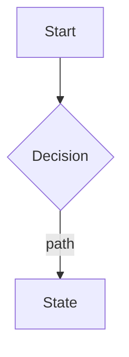
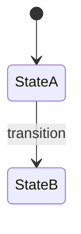

<!--
PRD TEMPLATE — canonical format for the PRD Writer skill.
This file owns the SECTION STRUCTURE and the SECTION-LEVEL GUIDANCE (the italic
"how to write this section" notes). The PRD Writer SKILL.md references this file
and does NOT restate the guidance below — single source of truth, no drift.
When authoring a real PRD, replace the bracketed placeholders but KEEP the italic
guidance lines — they help every reader understand the purpose of each section and
learn the house standard, so they stay in the finished document.
-->

# [Product / Platform] · [Feature Name] PRD

**Version** [V1 (MVP)] · [Draft for review] **Updated** [YYYY-MM-DD]
**Product** [names] **Engineering** [names / TBD]
**Design** [names] **Field SMEs / Stakeholders** [names]
**Status** [Draft — open items consolidated in Appendix D]
**Classification** [Internal / Confidential — not for external distribution]

> *Running header/footer on every page should carry: product · feature · version · date · classification. Treat the PRD as a controlled, versioned artifact, not a working note.*

## How to use this document

*Tell the reader how the document is layered so they go straight to the part that serves them.*

- **Main body (Sections 1–[5/6]):** the product brief for owners, design, engineering, and stakeholders. Should be readable in under ~15 minutes.
- **Appendices:** engineering and design reference — field specs, UX notes, workflow diagrams, any proposed-approach input, and the consolidated open-items table.
- **Reviewing for sign-off?** Main body only. **Building or scoping?** Start with the main body, then use the appendices.

---

## 1. Problem & Opportunity

*Describe the problem this feature solves, why it matters now, and the opportunity it addresses. A strong problem statement answers: what is broken or missing today, who is affected, and what the consequence is of not fixing it. Include relevant origin context — which deployment/customer requested it, and whether it is broadly applicable or market-specific. Keep to 3–4 short paragraphs of plain-language prose, written as you'd explain it to a stakeholder in a meeting.*

[Problem narrative — paragraph 1: what this feature does and the change it brings.]

[Paragraph 2: what's broken today and the concrete consequences.]

[Paragraph 3: the opportunity / what good looks like.]

> **Origin:** [Who requested it; whether it's general or market-specific; how it's enabled.]
> **Confirm:** [Any open question raised here — also rolled into Appendix D.]

---

## 2. Users

*Identify who will use this feature and how. Distinguish primary users (performing the core task) from secondary users (who monitor, review, or benefit indirectly). Note design constraints that follow from the user context — technical literacy, device type, environment, time pressure. If the workflow is shared or multi-user, describe the accountability model and its design implications.*

[Primary users + the design constraints their context imposes.]

[Secondary users + how they use it.]

[Accountability model, if the task is shared.]

| Role | Can [perform action] | Notes |
|------|----------------------|-------|
| [role] | [Yes — primary / Yes / No] | [why / how they use it] |

> **Confirm:** [Open question about users/accountability → Appendix D.]

---

## 3. UX Overview

*Describe the end-to-end experience in plain language — what the user does, what the system does, how the flow resolves. This is NOT a functional spec: avoid listing system behaviours or UI mechanics (those live in Appendix A). Write it as you'd explain the feature in a meeting. Two to four paragraphs. Follow with the Current vs. Future State table, which the PM completes before circulating for engineering scoping.*

[Narrative of the core experience — the happy path, in prose.]

[How the experience handles the messy/shared/edge realities.]

### Current state vs. future state

*The PM must complete the Current State column before circulating. Naming today's reality is what lets engineering scope the delta and surfaces hidden workarounds.*

| # | Dimension | Current State — *PM to complete* | Future State |
|---|-----------|----------------------------------|--------------|
| 1 | [dimension] | [Describe today, or confirm none.] | [What this feature delivers.] |

---

## 4a. Goals & Success Measures

*State what success looks like. List the metrics you're moving and why each is a meaningful indicator. Targets should be confirmed with the deployment/customer team before launch. This section answers: how will we know this feature worked?*

[One or two sentences on what near-term success looks like. Note that targets are proposed until confirmed.]

| Goal | How we will measure it | Target |
|------|------------------------|--------|
| [goal] | [metric] | [target — mark [Confirm] if not yet agreed] |

> **Confirm:** [Confirm targets with [team] before finalising → Appendix D.]

---

## 4. Functional Requirements

*List every functional requirement the team will build against. Group by capability area, not by system function. Use P1/P2/P3 for priority within the release. Include V2/next-phase items in the SAME table so scope decisions are visible in one place — mark them with the version column. Write requirements as outcome-focused statements, not UI instructions (save interaction detail for the appendices). End with a T-shirt sizing table for engineering to complete during scoping.*

*Nexleaf standing check — reporting: every feature is expected to have some way for people to see its data in
aggregate. The **Reporting & data visibility** group below is a standard part of this table. Fill it in, or — if
the PM has decided this feature doesn't warrant reporting — delete the group and record that decision as an
out-of-scope line in Section 5 plus an Appendix D row. Do not simply leave it blank.*

| Priority | Definition | MoSCoW |
|----------|------------|--------|
| P1 | Must have. Will not ship without this. | Must |
| P2 | Important. Can ship without it but high priority for V1 or immediate follow-on. | Should |
| P3 | Nice to have. Part of the complete solution but not critical for launch. | Could |

| ID | P | Requirement | Version |
|----|---|-------------|---------|
| **[Capability area]** | | | |
| R1 | P1 | [Outcome-focused requirement. Note enforcement and reuse of existing infrastructure where relevant.] | V1 |
| ... | | | |
| **Reporting & data visibility** | | | |
| Rn | [P] | [How users see this feature's data in aggregate — who consumes it, what question it answers. State the outcome, not the chart type; visual and layout detail belongs in Appendix A.] | V1 |
| Rn | [P] | [Any second reporting need — a different audience, cadence, or granularity.] | [V1/V2] |
| **V2 — Next phase** | | | |
| Rn | P2/P3 | [Deferred requirement.] | V2 |

### Estimates (T-shirt sizing)

*To be completed by engineering during scoping.*

| Capability area | Dev sizing | Design sizing |
|-----------------|-----------|---------------|
| [area (R#–R#)] | | |

---

## 5. Scope, Dependencies & Milestones

*Define what is in and out of scope for this release. Be explicit — ambiguity here is the most common source of scope creep. List cross-dependencies the feature relies on but does not own. Add committed or target dates engineering needs to plan against; if dates aren't set, note them as TBD rather than leaving the table empty.*

**In scope — V1:** [Reference the V1 requirements in Section 4.]

**Out of scope — V1:**
- [item (and where it's deferred to, e.g. V2)]
- [If the PM decided this feature does not warrant reporting, say so explicitly here — e.g. "Reporting on [feature] — considered and deliberately deferred; see Appendix D." Silence reads as an oversight; a recorded decision does not.]

**Cross dependencies:**
- [Things this feature relies on but does not own — existing infrastructure, registries, other modules.]

**Critical dates & milestones:**

| Milestone | Target date | Owner |
|-----------|-------------|-------|
| [milestone] | [TBD] | [owner] |

---

## 6. Platform, Performance & Security

*For features on an existing platform, list ONLY constraints that differ from or extend platform defaults. Do not restate platform-wide NFRs that apply to every feature — reference them instead. Cover: platforms supported, feature-specific performance/data-model constraints, security/access considerations, and rollout/support needs. If a constraint is shared across all features, a single reference line is enough.*

[Reference line: "Standard [platform] NFRs apply. Only feature-specific constraints are listed below."]

**Platforms supported:** [primary / secondary]

**Feature-specific constraints:** [server-side enforcement, data-model needs, dedup, etc.]

**Performance:** [feature-specific targets — mark [Confirm] if unvalidated.]

**Security:** [feature-specific access/audit constraints.]

**Rollout & support:** [flag/pilot plan, training, support playbook, FAQs.]

---

## Appendix A — Capability & UX Notes

*Engineering and design reference — not required reading for sign-off. Expand requirements with interaction intent, edge cases, conditional logic, and design rationale that differs from platform defaults. Organise by the same capability groupings used in Section 4.*

### A.[n] [Capability area] (R#–R#)
- [Interaction detail, edge cases, rationale.]
> **Confirm:** [Open detail-level question → Appendix D.]

---

## Appendix B — Field & Validation Specifications

*List every input field, its required/optional status, data type, and validation rules. Group by form/entry step. Include the status vocabulary and the audit-trail field list so engineering has a complete data contract in one place.*

### B.1 [Form / entry step] fields

| Field | Required | Notes |
|-------|----------|-------|
| [field] | [Yes/No] | [type; validation rules] |

### B.[n] Status values

| Status | Meaning |
|--------|---------|
| [status] | [definition] |

### B.[n] Audit trail fields (per record)

[List of system-set, immutable fields.]

---

## Appendix C — Workflow Diagrams

*Include end-to-end flow diagrams and state machines that help engineering and design understand sequencing and gating logic. Use Mermaid syntax for portability (renders in any Mermaid-compatible viewer). A flow diagram maps the user journey; a state machine describes how status transitions. Add diagrams for complex sub-flows (corrections, multi-user) if they aren't self-evident.*

### C.1 End-to-end flow

### C.2 State machine

---

## Appendix D — Open Questions & Confirm Items

*Consolidate every open decision and "Confirm" item from across the document into one table — the single sign-off surface, so reviewers don't hunt through the body. Assign an owner and due date to each. No engineering scoping should begin until all P1-blocking items are resolved.
If the reporting question from Section 4 is unresolved — or was answered "not this release" — it belongs here too,
owned by the PM, so the decision is visible at sign-off.*

| # | Question | Owner | Due | Status |
|---|----------|-------|-----|--------|
| 1 | [question] | [owner] | [date] | Open |

---

## Appendix E — Proposed Approach (prior thinking)

*Optional. Include only when the requester arrived with a specific solution already in mind — an exact table, set of columns, screen, mechanism, or workflow. Capture it here verbatim so the thinking isn't lost, rather than baking it into the requirements body. This is INPUT, not a decision: design and the PM should reevaluate it against the problem, users, and goals in the main body before it is treated as the approach. The corresponding need should already be reflected as an outcome-focused requirement in Section 4.*

**Source:** [Who proposed this and when.]

**Proposed solution as described:**
[The table, columns, UI, mechanism, or workflow as the requester described it — preserved as-is.]

> **For design & PM:** Reevaluate the above against Sections 1–4 before scoping. Nothing here is committed; the committed requirements live in Section 4.
