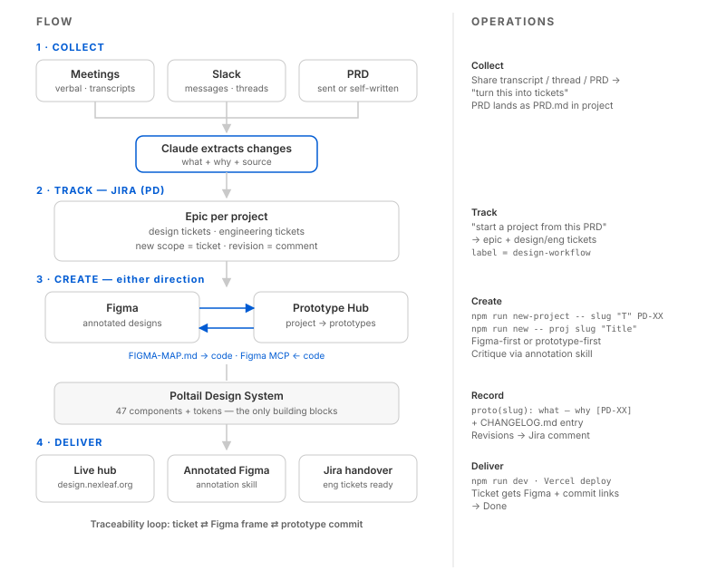

# 1. Overview



## The problem this solves

Design work was scattered: changes discussed in meetings got lost, Figma and code drifted
apart, and there was no single place that recorded *what changed and why*. This workflow
ties the pieces together so nothing falls through the cracks and work moves fast.

## The core principle

**One source of truth per layer, with deterministic bridges between them.** Nothing is
duplicated by hand. Each layer owns one kind of truth; the bridges keep them honest.

```
   FIGMA                 MAPPING                POLTAIL (Storybook)        PROTOTYPE HUB            JIRA
   design intent   ──▶   deterministic     ──▶  implementation       ──▶  compositions of     ──▶  change ledger
   (Polaris +            translator             source of truth            real DS components        (what + why,
    Tailwind kit +       (Figma comp →          (47 React components,      + history log per         links Figma
    Phosphor icons)      Poltail comp)          tokens, page templates)    prototype)                frame + commit)
```

## The four layers

| Layer | Owns | Lives in |
|---|---|---|
| **Figma** | Visual intent | Figma files (Polaris + Tailwind kit + Phosphor) |
| **Poltail** | Implementation (the real components) | `src/` (this repo) |
| **Prototype Hub** | Assembled prototypes | `prototype-hub/` |
| **Jira** | The record of every change + why | Jira project |

The **bridge** between Figma and Poltail is the mapping file ([`../FIGMA-MAP.md`](../FIGMA-MAP.md)) —
it exists because the Figma component set (Polaris/Tailwind/Phosphor) doesn't match the code
1:1, so we map them explicitly instead of guessing. (This stands in for Figma Code Connect,
which needs a Figma Enterprise plan — see [Figma Bridge](04-figma-bridge.md).)

## What exists today

**Poltail design system** — React 19 + Vite + Storybook 10; **47 components** + 6 page
templates; a token layer (`src/tokens/`); an Angular port (`angular/`); Chromatic visual
review, Playwright tests, and Vercel deploy.

**Figma** — a mix of Polaris + Tailwind Figma UI components + Phosphor icons. All icons are
being aligned onto **Polaris** (the design system's existing icon set).

## Traceability

Every change becomes a loop: **Jira ticket ⇄ Figma frame ⇄ prototype commit.** Anyone can
trace why any pixel changed, and nothing discussed in a meeting is lost.
